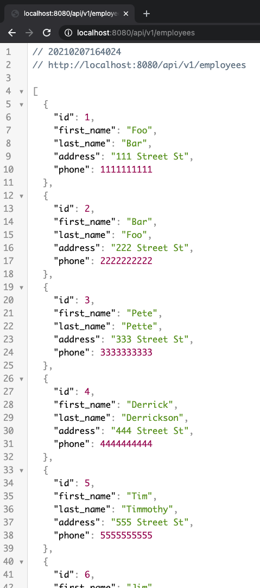
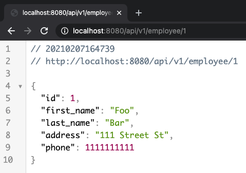
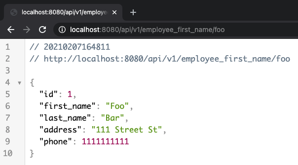
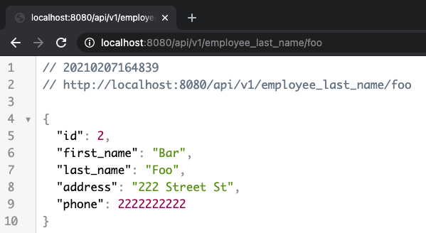
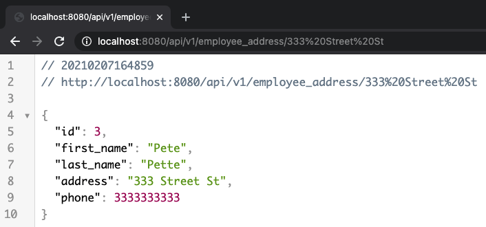
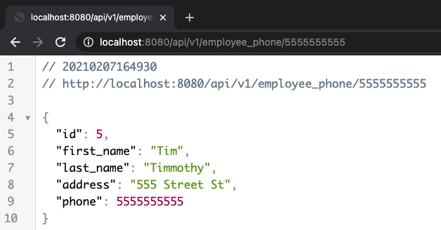

# EmployeeInfoGetter

Before Running:
- Install postgres
  - Run: brew -install postgres
- Install Intellij
  - Install community edition from https://www.jetbrains.com/idea/
    
Instructions:
- Pull repository (https://github.com/AlecCode/EmployeeInfoGetter)
- Open repository in Intellij
- Open terminal
    - Enter: psql postgres
    - Enter: CREATE DATABASE employee;
- Run EmployeeInfoGetterApplication in Intellij
- Open a web browser (Firefox, Chrome, etc.)
- Enter into browser URL: localhost:8080/api/v1/{command}
    - Commands:
      - employees
        - Ex. 
      - employee/{id}
        - Ex. 
      - employee_first_name/{first name}
        - Ex. 
      - employee_last_name/{last name}
        - Ex. 
      - employee_address/{address}
        - Ex. 
      - employee_phone/{phone number}
        - Ex. 
